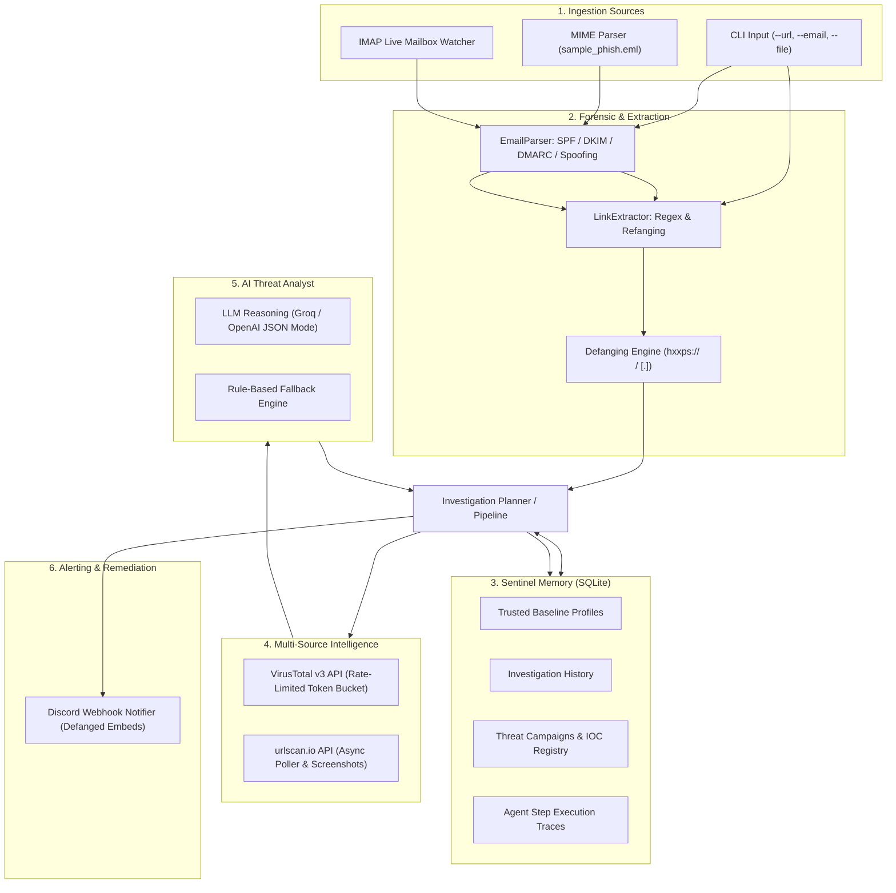

# 🛡️ Phishing Sentinel AI Agent — System Memory & Analysis Document

## 1. System Overview & Purpose
**Phishing Sentinel** is an autonomous Tier-3 Cyber Threat Intelligence & Phishing Analysis AI Agent system. It inspects raw email files (`.eml`), email text/HTML content, live IMAP mailboxes, and standalone URLs. It extracts URLs, collects multi-source external telemetry, parses email authentication forensics (SPF, DKIM, DMARC, display-name spoofing), executes an autonomous 5-step investigative reasoning plan, correlates attacks against persistent threat campaigns, and delivers rich defanged alerts to Discord.

---

## 2. System Architecture & Component Breakdown

---

## 3. Core Modules & Responsibilities

| File Path | Component | Responsibility |
| :--- | :--- | :--- |
| [`app/models.py`](file:///e:/Hackathon%20Snit/app/models.py) | **Data Models & Schemas** | Pydantic v2 schemas: `ScanTarget`, `VTResult`, `UrlscanResult`, `AgentEvaluation`, `ParsedEmail`, `ComprehensiveScanReport`, and `ThreatLevel` enums. |
| [`app/defang.py`](file:///e:/Hackathon%20Snit/app/defang.py) | **Defanging & Normalization** | Converts active protocols/domains to non-clickable strings (`http` $\to$ `hxxp`, `.` $\to$ `[.]`), extracts clean hostnames. |
| [`app/extractor.py`](file:///e:/Hackathon%20Snit/app/extractor.py) | **Link Extractor** | Handles raw, URL-encoded (`%3A%2F%2F`), defanged, and HTML anchor tags (`<a href="...">`). Deduplicates targets. |
| [`app/email_parser.py`](file:///e:/Hackathon%20Snit/app/email_parser.py) | **MIME & Forensic Parser** | RFC-822 header extraction, Authentication-Results (`SPF`, `DKIM`, `DMARC`), display-name brand spoofing detection, body & attachment parsing. |
| [`app/email_watcher.py`](file:///e:/Hackathon%20Snit/app/email_watcher.py) | **IMAP Mailbox Watcher** | Real-time unread email polling loop over SSL/TLS with non-blocking async executor execution. |
| [`app/scanners/virustotal.py`](file:///e:/Hackathon%20Snit/app/scanners/virustotal.py) | **VirusTotal Scanner** | Async VT v3 client with 4-req/min rate-limiting token bucket, SHA256/Base64 URL ID encoding, retry backoff on HTTP 429. |
| [`app/scanners/urlscan.py`](file:///e:/Hackathon%20Snit/app/scanners/urlscan.py) | **urlscan.io Scanner** | Submits scan requests, polls status every 5s (up to timeout), extracts score, verdict, tags, and screenshot URLs. |
| [`app/agent.py`](file:///e:/Hackathon%20Snit/app/agent.py) | **AI Threat Analyst Agent** | Sends structured telemetry to LLM (Groq / `openai/gpt-oss-20b` / `llama-3.3-70b-versatile`) with JSON schema enforcement + deterministic rule-based fallback. |
| [`app/memory.py`](file:///e:/Hackathon%20Snit/app/memory.py) | **Sentinel Memory DB** | Persistent SQLite store for organizational trust baselines, investigation history, attack campaign clustering, and execution step traces. |
| [`app/planner.py`](file:///e:/Hackathon%20Snit/app/planner.py) | **Autonomous 5-Step Planner** | Coordinates Recall $\to$ Telemetry Gathering $\to$ AI Reasoning $\to$ Campaign Correlation & Memory Persistence $\to$ Remediation Dispatch. |
| [`app/pipeline.py`](file:///e:/Hackathon%20Snit/app/pipeline.py) | **Orchestrator Pipeline** | Unified entry pipeline coordinating extraction, parallel scanner execution, LLM synthesis, and notification dispatch. |
| [`app/notifier.py`](file:///e:/Hackathon%20Snit/app/notifier.py) | **Discord Webhook Notifier** | Generates defanged embed payloads with severity colors (Red for Malicious, Orange for Suspicious, Green for Safe) and screenshots. |
| [`app/config.py`](file:///e:/Hackathon%20Snit/app/config.py) | **Settings & Config** | Strict `pydantic-settings` loader that verifies environment variables and prevents dummy placeholders at startup. |
| [`app/main.py`](file:///e:/Hackathon%20Snit/app/main.py) | **CLI Application** | CLI commands for `--url`, `--email`, `--file`, `--watch`, and demonstration scan mode. |

---

## 4. 5-Step Autonomous Investigation Lifecycle

Every target URL undergoes the following 5-phase investigation:

1. **Step 1 — Memory Recall & Baseline Verification**:
   - Queries `sentinel_memory.db` for the target domain.
   - Cross-references known organizational baselines (e.g. Microsoft 365, Google Workspace, Apple, PayPal).
   - Recalls prior verdicts and historical threat context.

2. **Step 2 — Multi-Source Threat Intelligence Gathering**:
   - Launches asynchronous concurrent calls to VirusTotal v3 and urlscan.io.
   - Enforces rate limits (4 req/min for VT) and shields against API timeouts/outages.

3. **Step 3 — AI Threat Synthesis with Memory & Forensics**:
   - Compiles domain structure, VT engine tallies, urlscan scores/tags, email authentication (SPF/DKIM/DMARC), and display name spoofing flags into a JSON prompt for the LLM.
   - Computes threat level (`MALICIOUS`, `SUSPICIOUS`, `SAFE`, `UNKNOWN`), confidence score (0-100), reasoning summary, IOCs, and remediation actions.

4. **Step 4 — Threat Campaign Correlation & Memory Persistence**:
   - Identifies whether the brand or domain is part of an ongoing multi-stage campaign.
   - Auto-increments attack counts and associates newly discovered domains.
   - Persists the investigation record and step-by-step reasoning traces into SQLite.

5. **Step 5 — Action Dispatch & Remediation Notification**:
   - Formats a defanged Discord webhook embed.
   - Attaches screenshot artifacts for malicious/suspicious URLs.
   - Dispatches alerts if criteria are met.

---

## 5. Persistent Memory Schema (`sentinel_memory.db`)

The SQLite database (`sentinel_memory.db`) comprises 4 normalized tables:

### A. `trusted_profiles`
- Pre-seeded baseline of legitimate enterprise cloud services and vendors (Microsoft, Google, Apple, PayPal, GitHub) to suppress false positives.

### B. `investigations`
- Stores individual scan records (`target_url`, `defanged_url`, `domain`, `threat_level`, `confidence_score`, `impersonated_brand`, `reasoning_summary`, `recommended_actions`, `iocs`, `vt_positives`, `urlscan_score`, `campaign_id`, `created_at`).

### C. `threat_campaigns`
- Clusters repeated phishing attacks targeting specific brands (`campaign_name`, `targeted_brand`, `associated_domains`, `attack_count`, `threat_level`, `first_seen`, `last_seen`).

### D. `agent_execution_traces`
- Audit trail recording every step executed by the planner (`investigation_id`, `step_number`, `step_name`, `action_taken`, `observation`, `timestamp`).

---

## 6. Safety Guardrails & Operational Standards

1. **Defanging Everywhere**: No raw URLs in Discord notifications or CLI plain text.
2. **Fail-Safe Resilience**: If external APIs fail or time out, fallback heuristics classify targets based on available metadata rather than crashing.
3. **Strict Credential Validation**: Regex filters actively reject placeholders like `your_api_key_here`, `changeme`, or empty strings on boot.
4. **Asynchronous Architecture**: Built entirely with `httpx.AsyncClient` and `asyncio.gather` for high-throughput non-blocking operations.

---

## 7. Verification & Test Suite Status

- **Automated Test Suite**: 55 Unit and Integration Tests covering Extractors, Scanners, LLM Agent, Memory/SQLite, Planner, Watcher, and Notifier.
- **Test Command**: `python -m pytest tests/ -v`
- **Result**: `55 passed in 9.51s` (100% passing).
